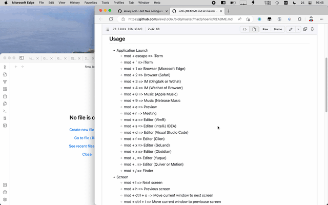
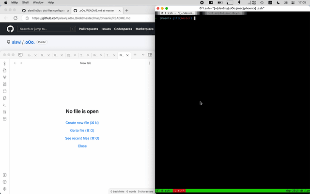
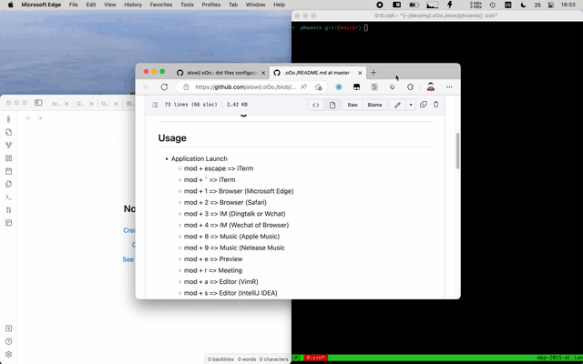

<div align="center">

# `.oOo.`

**A decade of Linux &amp; macOS dotfiles, still in daily use.**

A personal collection of Linux and macOS configurations refined over more than a
decade. Feel free to explore, borrow, and adapt.

[Chinese](README_zh.md)

</div>

---

## Philosophy

This repository is a single, self-contained `$HOME`: every file lives where it
would in a home directory, so installation is little more than creating a set of
symlinks.

Tools come and go, but muscle memory remains. Retired configurations are moved to
[`archived/`](archived/) rather than deleted, keeping the reasoning behind past
choices legible.

## Layout

| Path            | Description                                                              |
| --------------- | ------------------------------------------------------------------------ |
| `.*`            | Cross-platform dotfiles for zsh, tmux, screen, git, ctags, and editors   |
| `.zshrc.etc.d/` | Modular zsh snippets sourced as needed (Docker, Kubernetes, secrets, etc.) |
| `mac/`          | macOS-only files: Phoenix, Karabiner, LaunchAgents, and app support files |
| `linux/`        | Linux-only dotfiles                                                      |
| `local/bin/`    | Around 110 personal scripts; see [Toolbox](#toolbox)                     |
| `archived/`     | Retired configurations kept for reference                               |

## Configurations

Actively maintained: **zsh** · **tmux / screen** · **git** · **IdeaVim** ·
**Obsidian Vim** · **fonts** · **Phoenix** (a macOS tiling window manager) ·
**Karabiner**.

Browser keyboard customizations have converged on
**[Surfingkeys](.surfingkeys.js)**. Earlier configurations for Vimperator,
Pentadactyl, Vimium, cVim, and VimFx are now archived.

Split into separate repositories:

- **vim** → [miv][]
- **awesome** (window manager) → [awesome][]

Superseded and archived: Xmodmap (replaced by Ergodox), xmonad and xmobar
(replaced by awesome), and mjolnir, slate, and amethyst (replaced by Phoenix).

## Toolbox

`local/bin/` contains more than a hundred small scripts that glue the workflow
together. Here are a few highlights.

### Markdown and clipboard conversion

These scripts make it easy to move rich text among editors, browsers, Feishu,
and WeRead.

| Script                                | Purpose                                                     |
| ------------------------------------- | ----------------------------------------------------------- |
| `paste-{md,html,rtf}-to-{md,html,rtf}` | Convert among clipboard formats; `-copy` variants write back to the clipboard |
| `paste-weread-to-md`                  | Convert WeRead highlights to Markdown                       |
| `paste-simplemind-outline-to-md`      | Convert a SimpleMind outline to Markdown                    |
| `image-from-clipboard-to-png-*`       | Save a clipboard image as PNG and generate a Markdown reference |
| `format-gfm` · `gh-md-toc`            | Format GitHub Flavored Markdown and generate a table of contents |
| `remark` · `reveal`                   | Build remark or reveal.js slides from Markdown              |

### Networking and proxies

| Script                            | Purpose                                                        |
| --------------------------------- | -------------------------------------------------------------- |
| `myip` · `myip-*`                 | Query the public IP through multiple sources (dig, ipinfo, ip.sb, ipip, etc.) |
| `ddns-by-{cloudflare,dnspod}`     | Update dynamic DNS; `-wan` variants use the public IP           |
| `shadowsocks_client_start_*`      | Start regional Shadowsocks clients (HK, JP, or HA)              |
| `socks5proxywrapper` · `dig-http` | Wrap SOCKS5/HTTP proxies and provide an HTTP-based dig utility  |

### Images and media

| Script                           | Purpose                                  |
| -------------------------------- | ---------------------------------------- |
| `tinypng`                        | Compress images through TinyPNG          |
| `resize-img` · `-800/1200/2000`  | Batch-resize images to a target width    |
| `mov2gif`                        | Convert a `.mov` screen recording to GIF |
| `svg2icns`                       | Convert SVG to a macOS `.icns` icon set  |
| `qrdecode`                       | Decode QR codes                          |

### Git and development

| Script                        | Purpose                                  |
| ----------------------------- | ---------------------------------------- |
| `git-archive-zip`             | Package a repository as `xxx.git.zip`    |
| `git-code-numbers-by-authors` | Count lines of code by author            |
| `git-min-backup`              | Create a minimal Git backup              |
| `homebrew-using-mirror`       | Switch Homebrew to a mirror              |
| `check-brew-cask-upgrade`     | Quickly check for Homebrew cask upgrades |

### Desktop glue

| Script                       | Purpose                                                       |
| ---------------------------- | ------------------------------------------------------------- |
| `edit-server`                | Edit Chrome text fields in Vim through TextAid                |
| `fcitx-remote-osa`           | Switch the macOS input method with osascript                  |
| `apple-music-playing`        | Print the track currently playing in Apple Music              |
| `bing-wallpaper.sh`          | Download the Bing image of the day                            |
| `trash-put`                  | Implement `trash-put` with the macOS `trash` command          |
| `iterm2-{recv,send}-zmodem.sh` | Use `rz` and `sz` in iTerm2                                 |

> The full inventory is one `ls local/bin/` away. Each script is small and
> self-explanatory.

## Installation

```bash
# 1. Prerequisites: zsh, Oh My Zsh, and zsh-autosuggestions
brew install zsh                # or: apt-get install zsh
sh -c "$(curl -fsSL https://raw.githubusercontent.com/ohmyzsh/ohmyzsh/master/tools/install.sh)"
git clone https://github.com/zsh-users/zsh-autosuggestions \
  "${ZSH_CUSTOM:-$HOME/.oh-my-zsh/custom}/plugins/zsh-autosuggestions"

# 2. Clone
cd YOUR_REPO_PARENT_PATH
git clone https://github.com/alswl/.oOo. && cd .oOo.

# 3. Symlink cross-platform dotfiles into $HOME
#    (.[!.]* skips . and ..; the case guard skips repository metadata and system files)
for f in .[!.]*; do
  case "$f" in .git|.gitignore|.DS_Store|.idea|.claude) continue ;; esac
  ln -sfn "$(pwd)/$f" "$HOME/$f"
done
cp "$(pwd)/_.gitconfig" "$HOME/.gitconfig"

# 4. Link personal scripts
mkdir -p "$HOME/local/bin" "$HOME/local/etc"
ln -s "$(pwd)"/local/bin/* "$HOME/local/bin/"
ln -s "$(pwd)"/local/etc/* "$HOME/local/etc/"
```

<details>
<summary><b>Additional macOS steps</b></summary>

```bash
cd YOUR_REPO_PATH
for f in mac/.[!.]*; do
  base=${f##*/}
  case "$base" in .DS_Store|*.swp) continue ;; esac
  ln -sfn "$(pwd)/$f" "$HOME/$base"
done
ln -s "$(pwd)/mac/phoenix/dist/phoenix.js" "$HOME/.phoenix.js"
ln -s "$(pwd)/mac/_Library/Application Support/Karabiner/private.xml" \
  "$HOME/Library/Application Support/Karabiner/private.xml"
ln -s "$(pwd)/mac/_config/karabiner/karabiner.json" "$HOME/.config/karabiner/karabiner.json"
```

</details>

<details>
<summary><b>Additional Linux steps</b></summary>

```bash
cd YOUR_REPO_PATH
for f in linux/.[!.]*; do
  ln -sfn "$(pwd)/$f" "$HOME/${f##*/}"
done
```

</details>

## Phoenix: tiling window management for macOS

Phoenix provides keyboard-driven, JavaScript-scriptable window management. See
the blog post
[*Windows management for hacker*](https://blog.alswl.com/2016/04/windows-management-for-hacker/)
for more details.

| Application launch | Window switch | Window movement |
| --- | --- | --- |
|  |  |  |

## Related projects

- [miv][] — Vim configuration
- [awesome][] — Awesome window manager configuration

[.oOo.]: https://github.com/alswl/.oOo.
[awesome]: https://github.com/alswl/awesome
[miv]: https://github.com/alswl/miv
