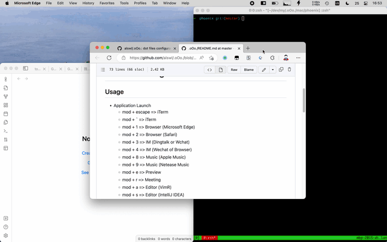

# Alswl's .oOo. #

这里是我的 Linux / macOS 配置文件，有兴趣的可以参考。

This is my Linux / macOS configuration.

目前的配置文件包括：

These configuration Includes: 

-   awesome # moved to [awesome][]
-   zsh
-   vim # moved to [miv][]
-   vimperator  # deprecated, use Surfingkeys in Chrome
-   pentadactyl  # deprecated, use Surfingkeys in Chrome
-   Vimium  # deprecated, use Surfingkeys
-   CVim  # deprecated, use Surfingkeys
-   VimFx  # deprecated, use Surfingkeys in Chrome
-   Surfingkeys
-   Xmodmap # deprecated, use Ergodox
-   font
-   tmux / screen
-   xmonad # deprecated, use awesome
-   xmobar # deprecated, use awesome
-   ideavimrc
-   .gitconfig
-   mac/phoenix, see https://github.com/alswl/.oOo./blob/master/mac/phoenix/README.md
-   mjolnir # deprecated, use phoenix
-   mac/Library/LaunchAgents/com.alswl.edit-server.plist
    -   com.alswl.edit-server.plist  # TextAid server for https://chrome.google.com/webstore/detail/textaid/ppoadiihggafnhokfkpphojggcdigllp?hl=en

Useful `local/bin` (scripts):

-   SimpleHTTPServerWithUpload.py  # simple HTTPS Server with Upload
-   bing-wallpaper.sh # bing wallpaper downloader
-   check-brew-cask-upgrade # fast check brew cask updates
-   crash # crash link
-   csv2json
-   ddns-by-cloudflare  # update dns record for local device by cloudflare
-   ddns-by-cloudflare-wan  # update dns record for public IP by cloudflare
-   ddns-by-dnspod  # update dns record for local device by dnspod
-   ddns-by-dnspod-wan  # update dns record for public IP by dnspod
-   dig-http
-   edit-server  # script for TextAid, use vim in Chorme, https://chrome.google.com/webstore/detail/ppoadiihggafnhokfkpphojggcdigllp
-   fcitx-remote-osa  # use osa switch macOS Input Method
-   format-gfm  # format file with github flavor markdown
-   format-markdown  # format file with markdown
-   funiq # file uniq, generate hash for file
-   generate-output-summary-md  # generate .output for yuque
-   generate-summary-md  # generate summary.md for markdown directory
-   generate_dash_index.sh  # generate dash doc index
-   gh-md-toc
-   git-archive-zip  # archive a git repo to zip, and rename it to xxx.git
-   git-code-numbers-by-authors  # analytics git repo by author
-   git_diff_wrapper  # deprecate, use git difftool
-   homebrew-using-mirror  # using mirror for homebrew
-   image-from-clipboard-to-png-copy-markdown  # paste image from clipcbard to png file with markdown format
-   image-from-clipboard-to-png-global  # paste image from clipcbard to png file
-   image-from-path-to-assets-copy-markdown  # paste image from path to png file with markdown format
-   iterm2-recv-zmodem.sh # rz for iTerm2
-   iterm2-send-zmodem.sh  # sz for iTerm2
-   jmxsh
-   jmxterm
-   lark-gen-markdown  # yuque markdown generate .output
-   ls-upload-log4d
-   markdown2ctags.py
-   mdcp  # copy markdown with internal links update (DEPRECATED, using Obsidian)
-   mdmv  # move markdown with internal links update (DEPRECATED, using Obsidian)
-   mdsearch  # markdown search, mardkown file search by title (DEPRECATED, using Obsidian)
-   mouse-tracking-echo-in-shell
-   mouse_restore.sh
-   mov2gif
-   mysql2sqlite.sh
-   paste-html-to-md
-   paste-html-to-md-copy
-   paste-html-to-rtf
-   paste-html-to-rtf-copy
-   paste-md-to-html
-   paste-md-to-html-copy
-   paste-md-to-rtf
-   paste-md-to-rtf-copy
-   paste-rtf-to-html
-   paste-rtf-to-html-copy
-   paste-rtf-to-md
-   paste-rtf-to-md-copy
-   paste-rtf-to-md-for-table
-   paste-rtf-to-md-for-table-copy
-   privoxy_restart.sh
-   puml-format-order-node
-   pyyaml-format  # format yaml with pyyaml
-   qrdecode
-   reduceimg
-   release-mvn-to-git-release-binary-branch.sh
-   release-sbt-to-git-release-binary-branch.sh
-   remark  # generate remark slide by md
-   reveal  # generate reveal slide by md
-   rime_dict_manager
-   rsocks_start.sh
-   scel2mmseg.py
-   shadowsocks_client_start_ha.sh
-   shadowsocks_client_start_hk.sh
-   shadowsocks_client_start_jp.sh
-   shj
-   socks5proxywrapper
-   soks5proxyhttp
-   soks5proxyssh
-   speedfox
-   sqlite3-to-mysql.py
-   svg2icns  # convert svg to icns (icons set)
-   svn_diff_wrapper
-   tinypng  # use tinypng to compress image
-   tinyproxy_start.sh
-   tinyproxy_stop.sh
-   trash-put  # implement trash-put command with trash command
-   tree2fulltree  # convert tree output to list
-   tsa
-   uniqf  # alias for funiq
-   unzip-gbk  # unizp gbk file in Linux / macOS
-   url_diff
-   view-pyc-file
-   view-pyc-file3
-   viscosity-to-ios-connect.rb


## Usage ##


``` bash
# install zsh
apt-get-install zsh
# or
brew install zsh

# install oh-my-zsh
sh -c "$(curl -fsSL https://raw.githubusercontent.com/ohmyzsh/ohmyzsh/master/tools/install.sh)"
# git clone zsh-autosuggestions
git clone https://github.com/zsh-users/zsh-autosuggestions ${ZSH_CUSTOM:-~/.oh-my-zsh/custom}/plugins/zsh-autosuggestions


# install .oOo.
cd YOUR_REPO_PARENT_PATH
git clone https://github.com/alswl/.oOo.
cd .oOo.
ln -s $(pwd)/.* $HOME/
rm $HOME/.git
rm $HOME/.DS_Store
cp $(pwd)/_.gitconfig $HOME/.gitconfig

mkdir -p $HOME/local/bin
mkdir -p $HOME/local/etc
ln -s $(pwd)/local/bin/* $HOME/local/bin/
ln -s $(pwd)/local/etc/* $HOME/local/etc/
```

macOS continues:

```bash
cd YOUR_REPO_PATH
ln -s $(pwd)/mac/.* $HOME/
ln -s $(pwd)/mac/phoenix/dist/phoenix.js $HOME/.phoenix.js
ln -s $(pwd)/mac/_Library/Application\ Support/Karabiner/private.xml $HOME/Library/Application\ Support/Karabiner/private.xml
ln -s $(pwd)/mac/_config/karabiner/karabiner.json $HOME/.config/karabiner/karabiner.json
```

Linux continues:

```bash
cd YOUR_REPO_PATH
ln -s $(pwd)/linux/.* $HOME/
```

## Phoenix (window management in macOS as tiling system)

Application launch:


Application in window switch:


Window movement:



More details in [Windows management for hacker | Log4D](https://blog.alswl.com/2016/04/windows-management-for-hacker/)

## Related ##

- [miv][] vim configuration
- [awesome][] awesome configuration

[.oOo.]: https://github.com/alswl/.oOo.
[awesome]: https://github.com/alswl/awesome
[miv]: https://github.com/alswl/miv
