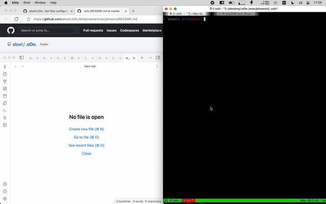

# Phoenix Configuration

## Snapshot

Application launch:


Application in window switch:




Window movement:


Screen movement:

(Image required)

## Usage (My preference)

- Application launch
  - option + ctrl + escape => Kitty
  - option + ctrl + 1 => Browser (Chrome)
  - option + ctrl + 2 => Browser (Min)
  - option + ctrl + 3 => IM (Dingtalk or Wchat)
  - option + ctrl + 8 => Music (Apple Music)
  - option + ctrl + 9 => Music (Netease Music)
  - option + ctrl + e => Preview
  - option + ctrl + r => Dintalk Meeting
  - option + ctrl + a => Editor (Neovide)
  - option + ctrl + s => Editor (IntelliJ IDEA)
  - option + ctrl + d => Editor (DataGrip)
  - option + ctrl + f => Editor (WebStorm)
  - option + ctrl + z => Editor (Obsidian)
  - option + ctrl + x => Editor (Visual Studio Code)
  - option + ctrl + , => Editor (Yuque)
  - option + ctrl + . => Editor (Mail)
  - option + ctrl + / => Finder
- Screen
  - mod + ctrl + o => Move current window to next screen
  - mod + ctrl + i => Move current window to previouse screen
- Window
  - mod + ctrl + shift + m => Toogle window maximize
TODO
  - mod + - => Window smaller
  - mod + = => Window larger
  - mod + ctrl m => Move window to screen centeral
  - mod + `\` => Window height max
  - mod + k => Next window of screen
  - mod + j => Previous window of screen
  - mod + ctrl + left => Move window left
  - mod + ctrl + right => Move window right
  - mod + ctrl + up => Move window up
  - mod + ctrl + down => Move window down
  - mod + option + left => Enlarge window to left
  - mod + option + right => Enlarge window to right
  - mod + option + up => Enlarge window to up
  - mod + option + down => Enlarge window to down
  - mod + ctrl + h => Move window to lef of screen
  - mod + ctrl + l => Move window to righ of screen
  - mod + ctrl + k => Move window to to of screen
  - mod + ctrl + j => Move window to bottom of screen
  - mod + shift + h => Move window to left, and resize half of screen
  - mod + shift + l => Move window to right, and resize half of screen
  - mod + shift + k => Move window to top, and resize half of screen
  - mod + shift + j => Move window to bottom, and resize half of screen
  - mod + shift + \\ => Window width max
  - mod + shift + , => Winow larger to left
  - mod + shift + . => Winow larger to right
  - mod + ctrl + \\ => Auto range windows
- Mouse
  - mod + space => Move pointer to current window
- Space
  - mod + shift + i => move window to previous space
  - mod + shift + o => move window to next space
  - mod + delete => move window to parking space
  - mod + ctrl + enter => move window to working space


## Build and install

```
npm install
# cnpm install for Mainland China user
npx webpack
cp dist/phoenix.js $HOME/.phoenix.js
```

More details in [Windows management for hacker | Log4D](https://blog.alswl.com/2016/04/windows-management-for-hacker/)
